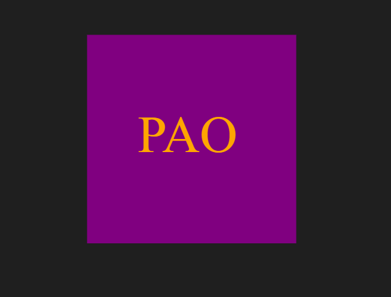

# SVG-Logo-Maker

## Live Screen Recording

https://drive.google.com/file/d/1n-TNnGLgGAF5zK5geUO12AWWJcfB4HlN/view

## Description
This application allows users to generate simple logos.  The logos are created using inquirer, which prompts the user to answer questions about how they would like their logo created.  The logo is then built and saved as a SVG file.

Example of generated logo:

## Usage
To run this application, use the command line to navigate to the directory of the application, install all dependencies (npm i), then type the command node index.js. You will then be taken through a series of questions. Once all questions have been answered properly, a message will display to the command line telling you your logo has been generated. Find your new logo in the newly generated SVG file.

For unit testing instructions, navigate to the Test Instructions section.